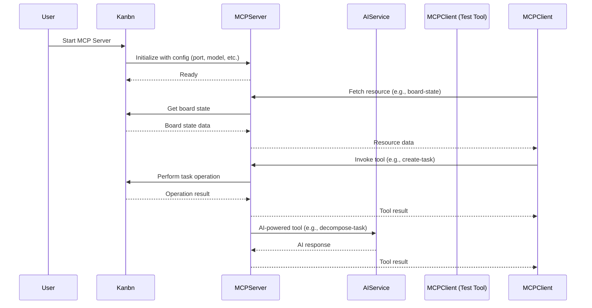

author:	coderabbitai
association:	none
edited:	true
status:	none
--
<!-- This is an auto-generated comment: summarize by coderabbit.ai -->
<!-- walkthrough_start -->

## Walkthrough

This update introduces comprehensive MCP (Model Context Protocol) server integration into the Kanbn project. It adds a new MCP server implementation, configuration management, controller logic, and test tooling. Environment and example configuration files are expanded, new scripts and dependencies are added, and mock data is provided for testing. Core Kanbn logic is extended to manage the MCP server lifecycle.

## Changes

| File(s)                                   | Summary                                                                                                                      |
|--------------------------------------------|------------------------------------------------------------------------------------------------------------------------------|
| `.env`, `.env.example`                     | Expanded with extensive configuration variables for debugging, server, AI, fallback, performance, conversation, and board defaults. |
| `.gitignore`                              | Added ignore patterns for `.aider*` and `.env`.                                                                              |
| `TODO.md`                                 | New file tracking project phases, priorities, next steps, blockers, and progress.                                            |
| `package.json`                            | Added MCP test scripts and new dependencies: `@modelcontextprotocol/typescript-sdk` and `mcp-types`.                         |
| `src/config/mcp-config.js`                 | New module for loading and validating MCP server configuration from environment variables.                                    |
| `src/controller/mcp-controller.js`         | New controller to start/stop the MCP server, handling signals and errors.                                                    |
| `src/lib/mcp-server.js`                    | New MCP server implementation with resource, tool, and prompt registration, authentication, CORS, and error handling.         |
| `src/main.js`                             | Kanbn class extended with MCP server management methods and properties.                                                      |
| `src/lib/ai-service.js`                    | Enhanced error handling for MCP/Ollama connection failures in chat completion logic.                                          |
| `test/mcp-test-tool.js`                    | New script for MCP server integration and regression testing, including resource and tool validation.                         |
| `test/mock-data.js`                        | New module exporting mock board and task data for testing purposes.                                                          |

## Sequence Diagram(s)



## Poem

> 🐇  
> The Kanbn code has grown today,  
> With MCP to lead the way.  
> New tools, configs, and tests abound—  
> The server listens for each sound.  
> Tasks and boards now dance in tune,  
> AI and humans, over the moon!  
> Hooray for Kanbn’s bright new dawn!

<!-- walkthrough_end -->

<!-- announcements_start -->

> [!NOTE]
> <details>
> <summary>⚡️ AI Code Reviews for VS Code, Cursor, Windsurf</summary>
> 
> CodeRabbit now has a plugin for VS Code, Cursor and Windsurf. This brings AI code reviews directly in the code editor. Each commit is reviewed immediately, finding bugs before the PR is raised. Seamless context handoff to your AI code agent ensures that you can easily incorporate review feedback.
> Learn more [here](http://coderabbit.ai/ide).
> 
> </details>

---

> [!NOTE]
> <details>
> <summary>⚡️ Faster reviews with caching</summary>
> 
> CodeRabbit now supports caching for code and dependencies, helping speed up reviews. This means quicker feedback, reduced wait times, and a smoother review experience overall. Cached data is encrypted and stored securely. This feature will be automatically enabled for all accounts on May 16th. To opt out, configure `Review - Disable Cache` at either the organization or repository level. If you prefer to disable all data retention across your organization, simply turn off the `Data Retention` setting under your Organization Settings.
> Enjoy the performance boost—your workflow just got faster.
> 
> </details>

<!-- announcements_end -->
<!-- internal state start -->


<!-- DwQgtGAEAqAWCWBnSTIEMB26CuAXA9mAOYCmGJATmriQCaQDG+Ats2bgFyQAOFk+AIwBWJBrngA3EsgEBPRvlqU0AgfFwA6NPEgQAfACgjoCEejqANiS4BZBt0iJKUigYBy2ZgMpcAjL4AmAwBVJwouAkR4DACABl8AZiN9Y3AoMnp8ADMcAmIyZRp6JlZ2Ll5+YVFxKRl5JiUqVXUtHRSTKDhUVExcwlJyKiKFUoxOSCoAd0dPZjQKeTkFRpU1TW1dMENU0wMNMgkOAwAiU4MAYnPIAEEASXzB6joZ1nn5bMZYTFJEM1gSSAAA32GAkgMgWXgVkgkzQyBIAA9uJglPQokQMPBIQxMLgLPIshQWOhHNEiNDAQARACiACFggBxAC8uAo2BI4Is0QBBBQGAYFmwShGvBI/wwUSkCgwkKI2CG8HwWCcuHEGCIiA0MH+TnQtFo6kVEoULkgzGwFnE3GhOJoRHwFHg0i4SgE2CIRDJ6Aw9As+A9XoAFGh9V6AI7YJ24M2KAEoyB+ogJkhSCwASgANJAbABhAAKjmclGlsvl1CNkED3AduCzSiyaAt0eYsYsWbQFj9k2eDvgnolWbmCOl5DERsQ7Z9ExIEek0fEbHweEzN1uhYoEngDABTBlfbL4iVleuebXAGsSLIJzGlBZr4hWSQ0MwvfhuIeB5BYPgH1maMxuEKeUSEnegCG4MAHEQZ9rTJFc7nXTdtwhDsLAENAGDPSBvC+TcHUrXh4DmBZEK3AEnCsMclSzBtO3QzDIDIFQrDYMYswoEhWXkah/3fa941vNBZBXQCKCyB05n5HlsExdVKyHSACAvT8FxIJda2lBh5Q4/lhNA6UXGgj8vyQAgSMktBSFY6NAyYgQWPYQdpGg0gEyI9R9IfB1LIBA0OLEB1hK1OBpABA54CJDBrMgCR5ngZjpAUTtqkkEh8UYjAEsgJRcG0KxiiVVl8AsfhTTCU0cLQPCKCzBCW1vSBsBckCULojCsIfIYSE9aQs1E8SKEk5DkSoNgaAofip13QzyyPUSogfMhtw0IwjEuG5LUKcdFPwRT/my0QLHmWbjQ+RFqwoYZ8O4bB7K3DLxHEaRkkgNxdoYL51US3lzprHs+Buu6GAew1pAAbn4DB0vCyLot3UsFSPWLHQS5Buw4vVUT5PaAWBA5wUhKwVtOY5kl2EEJH2BEYKsI4SYuK47geQpnkQWY3n4HIPu+Z6DBCoEKapmmOQhKEAVhZB0UxbFcWhpEUWeQliTQM1oiIjtGOpgCbUK7RZKTJV0twfbAQAeTzak3AAJVN4JoGpK2AH0T1uR2AGlqQATXBeMzYt63bftp2bFNmkABlwWR+L7O+3aVZKUVxUlHclQRk7FJIbWni1NwSGmJwqONdG431RX8Ndd1+yTeNEyr6UirvSsqTpRlASzQFczzR37YAZWgR2Q5pNugTd643FpNxHYARWCW5qWgYfATD02GUdsPqQANWpCOV07xDixVNUNQImtB1bdtO3wbtMkdftrxdyAL1kLNd1HYyuRfXBJrAoi1LwRAVwCU4nlZ4CFypkRLPuRGWBogCiFF6U2gEMBW3UsWeMptOzPhViNZ8nFKDIEDN+X8N40p/kzqJagwE/xvkglmTqT4XzqjTFqBClVqr1yJI3YufIiq0GwNuWgdD+GwHQMgQixF5DgOQhRFK1FWpoXahlZiZJ2KcRIjxchX9vT0EEleahyk3Kf2vKpdS39NLaSWrILUOYlQzWMhZKy7BCyqjJGjSgJcsY/UyjHEyXkFhZg/uoFAWiogAC8WrxkQIBBgWJJFmR8tlCK1RApalpPgeYOiSANibMgAaSVPCfkmA6M8WQuyOFyjQa8RSKBnj9CGUWaVBHaMcDiaE3DYGClRFqAAYtEVCz89SxSkvQLIT5cDAWQFyC8PAiQAWjIZI0Kj66ImjJCRp14OJFSiSlKUSh3ywH0irUplkdo7Q9NCDiGsH6tMbtEDOD43EY1gQ6C6TxaDBX2vgFwqFPg80UlQCUA1mDIGNgCQmYLZkkkYerEq1oMJimKo0U5RyLTpVGZQji9AYZKjhqnKB6dETCxNJQL05pLTwGtORW6iArz/mQPGN8W0lQaxwWNfBK1VrrWuJtaBILdqgoOgKY6H5kBnSRH9G+PBbpcmBuwUGvwDBQDeprC6V0AbSvunKp6jy4w8roBDAV3MvqiqhtxLIoyxAZU3LDJxUcsqEu1r5Q6wrtp3LxqCIWjrgQnDOIq8mnpxAYgdNYH1pMuX3AGCzNE7MSIfCNT8P4uMNABr7BgYNBMxYwjhI1bgtA3nIv1HtDiAJyDTFTcGngGiKDGmoDjDKtAuDAm0I0AAVIvCmw9fYdsrAKo6D5IYAlQHw2Cto6DMO1KFTGholTIGiJ1fh0YGRBN5OWjG4LRV8D8skx0iU5i4A+l6Jt8BW0+ynO6sEOddqIlMl6VdAI2RWB1dOFsUhJUdnGnQDla1GY8pOnyutSghW8s5iqiV/B1VAxBtqowb1yChrJmAMwodTYaGYA2+D4bmZdWja8WNXNPoJoMNcSApaRQcSTqlGAyHUMjMzRLTGzxeSskUQKpQqY3zRV4P6DiiBRU5AFW7TAAgsB73KsWIilLrInS1LcaMtB8BaWsiC2AxazR6x4F8JwiAuB5k0wCXwlYE5WCKGmYljo5JMDXTJQuHZ1DyA6fAuSYm+DiRknmj8dYSBIKUPyJ015sVRScSqbA3B2x4HFOIW0RosyUCJHwT6tAuTqizOhXUPGlwUG3AQgQ6SKBogqS1XKiAzz+e4Fua8TBBTMEKcUup9AxqOgYAA/SlmeT4GKgQorWF4xefug4zOjl8nVbU5lRxbERhKfHbpuEAIAiVjuVxogPGAEQgU01RKR5KlH2aQ+FQUJ4ChJOlmSY6gREICICIwivZcDyC65LYRojVZLfLHJLbuTIUz0xPOXaAApOcWYZLLrnGZhJeSXz6isLCDiMWfTVmiF/LMsUuTuei802L+EcRab6oKWdYxurQPudtvJCEiHRgTuWNQXIbvNJzGHNc8PlCFy1DYOg8BPAzMVI6and2+RwOFP1CSmBkJvgXAd9OgYcQHuSzwdrSWiB9SJITOCzT5OKfYOLh+HFRk6W3DFrWlLjFEmldIb8+Aj5Tb05ABI/A8BJcSiGIZAiIRjImW5aZCEyCfW3Epgisz3wxXwYs6Xu4aAIlwGANAUOASRugaorZ0SajSBXAXeUdmUAASJFIH3gYfsAHVoAxVsyjuRXVDGGml42A00Za5wX0qIH8tLM4qswFEGdlYN490gDY4UKyyCt4wFmJduAAASt0u9vihGbnggp+xZlp2uT3QuBtjAATJ0oBongkZWeUrz9KMY5RAfQE7xtFK/0Yg+dWlS0f6+hH9/tW3ljkUxNwQCWi8lI+PS9pMXWYxZ6cfGSrApTWUyJaEgaxCxMYbCP0TCfBXnTpHkfacgMuPgPeAUJ0SAh/FsTCa8F8XjL0AXQaJfPkedKTDzFXNbUgisXiI6SpLUK2UQJxRbZbEyC7LkC7LRIzTiCsONCtAgDrY7WrdJerNRcrF+YqIA/rayGLMrYGBgS5YyXbSnMXMgoBa0fAWQaKXkFWB/ALayL9BmDacaP9U5VjZ1YDMVVVf6KVSDLVPzF6WDAEQMAVcFFAelGZfAEQS1H/ZjTCUleYM8eTSYLAVXTwQbNNR/QVI6cwvgKWDFRKbhEMLGfCeqLEJ0WgZheDP1RDAwZETCHyDQIQRAJUOmM4TDGPfNNmXDd4fDHmBVfmQEXIs8fIwopUDNNpbNELdzRjOOQtUjB/RAOQilLRDiGg7oyAY4ZgewY4QnMkLUHuaJVIm5AZAVY4LbDgVCaYgYx0f3ejXvH0MYhzYUNkDAfWOtUjVYucDgSY7gTYwY98D5VTUjLYoYp9eHIkPhARLgC4h8K4qY05Y4oENNYULbAAemuLAC2whNlwKMQGHm+M4GuI4HS3lCy2mN5ABIFWgjYB2mKhhFOxJEBAgGRMy2kAJiOnl2aXhN+O4A4D4LvDRN2gBKCWPxERVkJKhI6zJMshYVDA/H6T/CKS32mD2QyCWj8xhHcQYwbSBAAAF6o0oQ8VkuMCBKsQSbtAJnj3wwBEBaAzwfZ5lA8jxAQAA9WIDQAATg0FiFPXoEBHBPVNJPQANImgrBNLNIAFYNAAhgRXpdozd/g+B41Y5gCL8nM7itFy4vNRTfN4jJS5glB9CuVf0RUTD9pAMojjCLCwNroNVZUxh5UXprhS56BSMMBuBmAWltitE3VGjmiiiMBAQjhIBdAgQqTrjjgvigSeQ5wwT7AIS5wOSLAYTjhAQDBmyoBAQ2z7AkTpAMtUTOzYxCdeyIJIS6SYTNhiTUTRzxzWy1jES6TEAOzxiuylz7SBy1zCjNgDyRyxyWzghc181Jy1iNjwRNTvs4ChRcZjgyyKyMTLj2zRzFUbhiyhSDpvMxTEoaz2o6zWimyWzJy5TWxFSw9lSFNio1TZANTwztTdSjzjhTSLSrSbydzJz7TMLpA8KCLPSAgbz6YsijBEBMsQT4Y+xlywAWKiAYSSiw1GYI0ChsMXgJEQMgyFViNSMOKDwKx6oLRcY7BuAbE9wiBwRugxh3j+Exj+srUIocV2AwBUtWZOIj5cl8JehRNnAyIZNq8hD4RQRtLAtIC7UY5kAmpD15MaBQQbS+RDRbNwlkAJKCcuNRJtUPyDQ5IGiaxwRAx6xGxyVXtdp/AAAWBIBKlcO01sSK6KpsL0XkQEAAcntH9CsBBKsjmDAASDAASoEDAHUA4EJBIBIFysBFStQivjoFNlvjnUipGicHoGzXjhYFKqcBwWGC5H7Xwk0W4goCoD0maUBDQDKzdkvB9P5l3HnQCkDNQjcMBA/y6PBDGm/DAi+DJwgLxHqH+GwJQH4xNlVWUrcJ2p4W6koACX9Drl6HRz4E3BVhVjwH22pyyGs2MixEL2R3TgbChE1AnRvBktA0ujcKiHVGMyPDnVyikhA2NlQH8vTiFV40TJ/SMJTKYzTLMMzJyF+kuisMBhlSgzsKAqLKxmxuQA7nsAUtlGUqwEBEYoYGYrxSIDYo4phPBBZOlDWrMlmp2qeD2s4gOpWigGpHFXJt6tJARs4iRolBRuFxyCZvkp5sjniiBGkqJjJq/m9ToogGyM5u5tUuKisAoD5sKk4Rtq4ow14qwwqJjWqN+WNSMDErzihuhBUt4XUsOtrSNvpSwDhFkH5BUyVCXFyQBqoN2l20um9GzHzH3goEsvT1VThqLEDL7Qqx5skrkXjB+qpwJHjpnQ+TBQrpgS+3ii5F8rrWczxJP1ZTwQmghEhUNULoJ3jBVgriTGOSTH0syHDqwF0NtTigSkztBWVFylhqbtztEUjo+kiljvxCrvcKy0mRAONDyQFR7luAZFuDcAL1iJKl5Ge23H+s7DiTfEXo3DQSnGvU0EgFuByEwHkHev4AYC0g7r4XMyTCTvGVC2CQTH9GUzCimpMufoRHUEga3uchbtZJQihGAkf1xsMKZWNEJqdSAxJphrVWsKptsN5igDpueDevluGAjqjrXqaghBruxg5qYpDwdsoDtqtuSgzsKMFvxNiPGQ4kbVoeBkDCaIwGE3bAoA1FMyZD0EgAAG9IANAVHIAABfUc023YC2rkAQEE7QbU8y5aQo7igwpmco4YSooSuNAjXmfmb+hLOXcBz0YGO5AVQEbmXAGxR1D8SW42RQXK5ADBI6OYeReiLCeyBTLCXYjAL3MYnKaoRwBY7EEcWRce6BjukY/NXkPeQMQTCRkTNO5zUzfCYJrBGTK6qBuLM0ZyBJEPPWGQf08Y6kHMU2Nwa2akbpYIHuakSkaY+MVVcYxK5K44dsJJ0Qeug7Z4b+1AY2IkIIwZJAbK/adbPgLxNmDGEgU7YsMp0J/CATITQpgsZu1AY4/WLMQ45ZgEXsfsDWb+g/cGrUU2UFCgE7JwP8Im7JS0RiDJmp3jBJVAPYzxXaQ4uMPaCKTId8CsPJYBq5yAfJ4TVO453Oi+JUDUY9BAsKOB0MpMZGtkQuYymIwyuFxBMgFBPAYsB+J+cDCYGSU43ZtATB7lfG7aXByIl1NvLMhWmlymzVfM6DIC5VESiUjGeMtrADYmlM/CAR13Lloh3lvMx6cUt1O4HuIxjkYmX1M2hipi3Rti5zJ2+mMo/it2qo4S2x0S0Cg23GBFjAOStVx+igW6nhNSp3XkOQsZOMKcTS0ytOwMGwVscfPHMPSAPMIkFU4qUzE5vHZ7YYIWlWW14g9WsAyGk5vynu54IWkXbaNmD6R7VVWqNceUtsA6N0JMeU/STA2MTOtWcQHy+3LAMBdV5pX15Fx1pNogoWsaEMagL6qaeavbKncUvJTc3qHEu8fSLjOZTUIwGwY9RLPOeYQdZADiT0RaTFVbPgKly8XICLLcI7LvU2K2TvRxr0EeyGdAS+a+cDPsOdOvX509uSIWh5/KUt90G3XAG6aMSYcUJRGOd5bMLKylJF6cIolE+3ffLJbkJpS5uSKd/3BZGdFLXLfLJ4C5n0SQY9bADWO7aQ+6agp4AuqrYIqDuupD5papWpIQmp1kcrKutLWc8DsRTPDF8pfFwR54H7HuNplpf4OYMO3qmlOhmOhh0gVUWA42WtBnKgS1IWg5gpjt1G9EkQlMa5wMlgL9+9NKFMXEbKXtjlYjBOcjPvSjFUEDPeA81w6cNdj9MCXaAgisxlYDXN1kvy+QpZQDDTn8JZF9JZTor/fSW8Lg17OEErCGD1r/RiGQ97YkLjTw6MDFuECGBxL0QA6rAhCL4ySJGsOCCGB2s9xReD50/vRACGCx1LwqFZCPKPRSUL0r70DsWQUJL0KJczaMTZIkbZMcWoCGPu0MCzAa9gf9O7ejtrDrRqXUNu8aNGfE8WrLqcaICQfAaZRN/axQDdVcX5MnDT4zVl3aG+wmC+/4CKRh/kPksujlMNjTrRJd6zkAjduT8hUYgTwvFGJyzd6cePHZLT7Ov8ULg6N88cOhCpBh/zypOvGQ7CS5AIq+T8NmF/HLpzVkBdYCegBCaTjCEVFhQncdj7njYl17YHdzFWDGpUKvI0fpO79d54Nx4HeUjlfmZu36LTZe4TtNBhjm+e3ATyznt8Pxg6/9Nh3E+BtyC1WQAUFqIWmvOSPJJzk6DWXbcZF77+jiVVWYyGuVJ5R1Sgo8JaeatmZ7+Fw57CFDkbHyaKeMJmOEBaYYLrEEuLxJyj0pK+Gb9GsekD5uwkXBSjpl5MvbiV/BqV0m6him3M6msh4C+m/OkeQ5+13OtmoEHR+APR8Eg13h5ButcSK9/AsPtb2gbTW8ic1a5H9asRw5rMbNtvJkRRtRtMbc+C1d+764cLQMOvwvoERv9d6kDJ4fFEOXVv+viczv8aGxCaAf9vwEYfygegsDkkxAcfkiqfigaAWXeftvxf7qe76AOcFfjrBfhvzf9dq76d/fic4B1vyAHTWZJAEgYAHLYqJ8DAPQQfxP8CC/q/lgG/4AJb49Z/l6OWywraVtZx9HW4IBmo9mtaENO6xIFhlzT1ap9c6AtTItqwMAW05g0QQ1qURdoWNWY7tc1rUUTSe0fgLrRQOpQeqxtuCH9I5pWADYNQFKoeaMFdwjbph06PCflPtETYM1se4lGdCjWjAdx8wjsPMEewXhWd6w0HR7KYS+bRhBm+9faGZUdbcDfayNIgoFUoDU47S9gB1i4GdaJExi34CwIdXIhL0VBUkB4vVVAoiNo67PZAHnz3weI6ARwICpz3mC4AQBLgKsDWDr5cAe4XPBBgoNNCbZ9oXXVIlYUyrfNVUFTFOgEPEz0oLAlyWgPIDOZLIgkXkbgLOlWQRQHwmdDiBGCSQINgQIJeAX2Wcx7VSBVgF+PIXtygVo2u2VGlmyhZt5YOSYAtiQhKhKwKyE9BylPR8QCCu4NIbpNcGCBhx+4g8beJ2inAD0IQ5JaARWWbj0gGQ4ILofMh6FEw367XTiPKBrQm8H+vQaIAaCixOZ+E29LUN3zizIAAGLXLniFnQAYwcQ7oWABpFrjPBPqQIUunZn2AZMJh9AHjE2GxhHIOwDHQRhgA5Rn9wI7gygAPx8HgR/BRTEwTkCCSnM6WXoAAlYHmAFDri2gygOCC1zuIzBL0QEEgAhEUArYyI9UFCMgD0FgRbhe/miNroHDIuP7KWsWAFQxC+AGNE6ulGSHqgDOvJCnrfQ+YAg2RjAaPt0AAhgYOhdaQEIhVvDIVP24bNChYAwpYUqyOFPUpWjyKuRa0AqcCGjX2jgpL0/AF5iGW2yJh7oGOe2riWd5lpbBigUIe8lWhmM/ebeNlumQ5anRg+gAnlmH1IYKpyGIFNQZdHkB9ChBIgyKhgE8DeAKApmd1tH0BC2sE+sAsEnrAFoy1I+zwQMRoMxHx9KwggeLgAB8IxnYGMe9DjEJjmGaAlMbwzTEUNhC/jW0iI3KSuDiRngy6AAH4uAEYrwJQDTAf9cCt/WkY/2f6nJwB8Yw5omMrEYDqxtNECnnyBCNi0hLY3saG2v5OBv++AX/uCFjHW8Y+BTCcUxXQEgjpx/orGHOMJGIBiRpIk4mSFb5cBBxmALcaWJ3Fji9xFYg8VWNhKatSY9FAwKCTPIPhBymAniquFdqWM8BNjAgURlAr9Fwy+tPsquWhLp8A6rrMYnN0HQxsCccneQX61oFpQg2DAlcWbkVFRsl6LlV7CbDko5guQ7AAmF3WwkFhoA5FHuLBJ7iUg3Ym9N8l5TrYN1vo+0NAk4njbgNWkrA4IFbDDgttG2p4R+JeEFFYAHOOdWcKjQ+BWD6GIKOcBDVkyiwJoqyTiB9F4kAhjgOWDJNqQKzTFR2zSRMBkOQCZRsSABcQulxzgrILm84dSbj0W4KZ04SwTLiiOgn/chaIQtZL1VVCOg3QV+GuBAzrSZdGM/3W4JSBnq/s3sKdJmFk1t6y5sI9mUEMty9DHBPO4opwBCVC7TEghJaPOOlCilgR/u4U4+KYQTjedjIvwy0Az2CGwT/ql0AMrSxwaCkVQfGYGp/mMhvYuASoMFPhFyGRgN2o7F7kNI+4HlN65kxKS4FiR1pRQTgJSTkCcDfISo1LCaZWEMkocTJTwUZuMS6yHTjglHOrGAAazlYTpaXDAGAHEFkcJQxwUzEsFGT7oEAckJ8Hm3jBzMr4KI9JtUyBqf1bhAIXAvDU4qQ06ShOeEAiFEAUsSQYQcUh8EhnuSosbeIWudGqAZjjobKCaOhz5w+SH8mOBAiHSRDVAw6PzapoGF85yRtC/3LQiRiVBgBr0i0SAjdNMwMpyAe0WtIgG/AWho0v9eqvQAlzucaZQ2DAOOn5iQzEpekhiHkksz+RowDjPvme3kB7opcSYb+mwH+bEDLIDTRWaTLEBYzxO1aF7omBmACzeMfzZqPSl/oOhQq5IKxEYDOH4RH2uLWdNr3YCMZo6Dw9SBny4jsVqAebSJtgV64YACQeUdBpZJTqazamWo2BiLwFRcZt6GfAEWgzuHVtU2sE9bM5XEBl1TuBLD7tLyTBTCesvzLWdbM3pfJlAnYDhFaLKQ9AhOq9ETi9ycCKTuJMODZl6E+kiJCZO3PBDICyQVok5gs7KuwJKlh4OUSZFli6LHnstzCno7MhBhIb8saaSqX2uBDABWBUwrPYGP9TO6uktsclW4BhJOgD8pSzDP8fBPPKITYSgrdeTQi3l4TGxe8wuECC2wz85y0gCXNRLGB19z5bqS+SuWvnFQkBa86YBvMfklRn5TDQEFtl353hv56BXAH/L0H0AAFPZf8eHgvK3ytG2RP8VEzun6cTGztECTgJwzWMaiXtKCaRkgFG1SUUTPTrlEqDxdkAmmbCPVXDrFka2/IeAltSwJnhj5SgBEOCDzGJNVe+PfMqLKMl5YSMuCegMcG379o0kGSaYnJ0FI3TtM4xWkO1ETD9MpwxwY+YRKWzOQNA0xeojdJZy5Rie4ILjJuCUD0o+RzKEqNECBSg19m+0Y4Noswi6KxZdCZJrIFvRaIneZSRXnGGQCGSdF/oUxZH2nSZQBRBJfhdADq4iKqglqIdKR2eD1M1YossGdCB/xC1YpR0gcr4AzDTEbJzwBRcDiSXFZSloiKWGMRWJeKqORAaYjdI+SoB+FjClWMFgcCoApkaUDKe5Sxj705wr4TdKpz9DllGC8oasFpl97TycGs8t0fPMIah8bCK8iPrnGmBG0pSjafhYIsRApL4uGfaRZklyjg0L5GCghcT1AWvRfaOy1BXsqibVKSsRyx3viR/wvtccb8q5ZhEIW5QkBWjbYB0HrQgZGweQMhRNjKATBI8glDmF5NjBNA1grQTYIYBBUlBP4jsY9IgEdgcRNwecOgI7GAaoqdgUAAAOy+AGAsQbcAwAABstAWILSvNJoA0AAADnNLmkGAlVVlaMlpUJASACVc0glVpWsrfAtAAQKypIACBYgtAa3CkAMDoqBq6gLFfn1xUpgnQ18R2BkFRVAA== -->

<!-- internal state end -->
<!-- finishing_touch_checkbox_start -->

<details open="true">
<summary>✨ Finishing Touches</summary>

- [ ] <!-- {"checkboxId": "7962f53c-55bc-4827-bfbf-6a18da830691"} --> 📝 Generate Docstrings

</details>

<!-- finishing_touch_checkbox_end -->
<!-- tips_start -->

---


<details>
<summary>🪧 Tips</summary>

### Chat

There are 3 ways to chat with [CodeRabbit](https://coderabbit.ai?utm_source=oss&utm_medium=github&utm_campaign=decision-crafters/kanbn&utm_content=112):

- Review comments: Directly reply to a review comment made by CodeRabbit. Example:
  - `I pushed a fix in commit <commit_id>, please review it.`
  - `Explain this complex logic.`
  - `Open a follow-up GitHub issue for this discussion.`
- Files and specific lines of code (under the "Files changed" tab): Tag `@coderabbitai` in a new review comment at the desired location with your query. Examples:
  - `@coderabbitai explain this code block.`
  -	`@coderabbitai modularize this function.`
- PR comments: Tag `@coderabbitai` in a new PR comment to ask questions about the PR branch. For the best results, please provide a very specific query, as very limited context is provided in this mode. Examples:
  - `@coderabbitai gather interesting stats about this repository and render them as a table. Additionally, render a pie chart showing the language distribution in the codebase.`
  - `@coderabbitai read src/utils.ts and explain its main purpose.`
  - `@coderabbitai read the files in the src/scheduler package and generate a class diagram using mermaid and a README in the markdown format.`
  - `@coderabbitai help me debug CodeRabbit configuration file.`

### Support

Need help? Create a ticket on our [support page](https://www.coderabbit.ai/contact-us/support) for assistance with any issues or questions.

Note: Be mindful of the bot's finite context window. It's strongly recommended to break down tasks such as reading entire modules into smaller chunks. For a focused discussion, use review comments to chat about specific files and their changes, instead of using the PR comments.

### CodeRabbit Commands (Invoked using PR comments)

- `@coderabbitai pause` to pause the reviews on a PR.
- `@coderabbitai resume` to resume the paused reviews.
- `@coderabbitai review` to trigger an incremental review. This is useful when automatic reviews are disabled for the repository.
- `@coderabbitai full review` to do a full review from scratch and review all the files again.
- `@coderabbitai summary` to regenerate the summary of the PR.
- `@coderabbitai generate docstrings` to [generate docstrings](https://docs.coderabbit.ai/finishing-touches/docstrings) for this PR.
- `@coderabbitai generate sequence diagram` to generate a sequence diagram of the changes in this PR.
- `@coderabbitai resolve` resolve all the CodeRabbit review comments.
- `@coderabbitai configuration` to show the current CodeRabbit configuration for the repository.
- `@coderabbitai help` to get help.

### Other keywords and placeholders

- Add `@coderabbitai ignore` anywhere in the PR description to prevent this PR from being reviewed.
- Add `@coderabbitai summary` to generate the high-level summary at a specific location in the PR description.
- Add `@coderabbitai` anywhere in the PR title to generate the title automatically.

### CodeRabbit Configuration File (`.coderabbit.yaml`)

- You can programmatically configure CodeRabbit by adding a `.coderabbit.yaml` file to the root of your repository.
- Please see the [configuration documentation](https://docs.coderabbit.ai/guides/configure-coderabbit) for more information.
- If your editor has YAML language server enabled, you can add the path at the top of this file to enable auto-completion and validation: `# yaml-language-server: $schema=https://coderabbit.ai/integrations/schema.v2.json`

### Documentation and Community

- Visit our [Documentation](https://docs.coderabbit.ai) for detailed information on how to use CodeRabbit.
- Join our [Discord Community](http://discord.gg/coderabbit) to get help, request features, and share feedback.
- Follow us on [X/Twitter](https://twitter.com/coderabbitai) for updates and announcements.

</details>

<!-- tips_end -->
--
author:	gru-agent
association:	none
edited:	false
status:	none
--
## TestGru Assignment

### Summary

| Link | CommitId | Status | Reason |
| ---- | -------- | ------ | ------ |
| [Detail](https://gru.ai/:test/decision-crafters@github/kanbn/3915dbef-46c7-45be-b313-01a285edad71) | 71c0cec6d069aa899c4b8fe63e494681db8eb0d3 | 🚫 Skipped | No files need to be tested {".env":"File path does not match include patterns.",".env.example":"File path does not match include patterns.",".gitignore":"File path does not match include patterns.","TODO.md":"File path does not match include patterns.","package.json":"File path does not match include patterns.","src/config/mcp-config.js":"File path does not match include patterns.","src/controller/mcp-controller.js":"File path does not match include patterns.","src/lib/ai-service.js":"File path does not match include patterns.","src/lib/mcp-server.js":"File path does not match include patterns.","src/main.js":"File path does not match include patterns.","test/mcp-test-tool.js":"File path does not match include patterns.","test/mock-data.js":"File path does not match include patterns."} |

> [!TIP]
> You can `@gru-agent` and leave your feedback. TestGru will make adjustments based on your input

--
author:	coderabbitai
association:	none
edited:	false
status:	commented
--
**Actionable comments posted: 12**

<details>
<summary>🧹 Nitpick comments (11)</summary><blockquote>

<details>
<summary>test/mock-data.js (1)</summary><blockquote>

`1-16`: **Improve mock data consistency and documentation**

The mock data structure looks well-organized but there are a few opportunities for improvement:

1. The `mockIndex.columns` contains empty arrays, but `mockTasks` defines a task for the "Backlog" column. This might cause confusion if tests expect tasks to be pre-populated in the columns.

2. The "In Progress" column lacks metadata unlike the "Backlog" column.


Consider adding:
```diff
 module.exports = {
+  // Mock data for testing the MCP server implementation
+  // Simulates a Kanbn board with columns and a single task
   mockIndex: {
     name: 'Test Board',
     columns: { 'Backlog': [], 'In Progress': [] },
     columnMetadata: {
-      'Backlog': { workflowState: 'backlog' }
+      'Backlog': { workflowState: 'backlog' },
+      'In Progress': { workflowState: 'in-progress' }
     }
   },
   mockTasks: {
     'test-1': {
       id: 'test-1',
       name: 'Test Task',
       column: 'Backlog'
     }
   }
 };
```

</blockquote></details>
<details>
<summary>.gitignore (1)</summary><blockquote>

`41-43`: **Remove duplicate .env entries**

The `.env` file is already ignored at line 6, making these entries redundant.


```diff
 generate-html-report.js
 .aider*
-.env
-.env
```

</blockquote></details>
<details>
<summary>src/controller/mcp-controller.js (2)</summary><blockquote>

`8-13`: **Use config values consistently instead of environment variables**

The controller uses `McpConfig` for most configuration values but directly accesses environment variables for the debug flag.


Consider using the configuration object consistently:

```diff
 const server = new KanbnMcpServer(kanbn, {
   port: McpConfig.port,
   model: McpConfig.model,
-  debug: process.env.DEBUG === 'true'
+  debug: McpConfig.debug || process.env.DEBUG === 'true'
 });
```

This assumes that `McpConfig` would have a `debug` property, which should be added to the configuration module if not already present.

---

`22-25`: **Improve error handling with more detailed logging**

The current error handling logs the error message but doesn't provide the full error stack trace, which could be valuable for debugging.


```diff
 } catch (error) {
-  utility.error(`MCP server failed: ${error.message}`);
+  utility.error(`MCP server failed: ${error.message}`);
+  if (process.env.LOG_LEVEL === 'debug') {
+    utility.debugLog('Error stack:', error.stack);
+  }
   process.exit(1);
 }
```

</blockquote></details>
<details>
<summary>src/config/mcp-config.js (1)</summary><blockquote>

`17-22`: **Consider expanding validation**

The validation method currently only checks if port is a valid integer. Consider expanding validation for other critical properties.


For more robust validation, you could add checks for:
- `model` (not empty)
- `apiKey` (format validation if needed)

```diff
 validate() {
   if (!Number.isInteger(Number(this.port))) {
     utility.error('MCP_PORT must be a valid integer');
   }
+  if (!this.model || this.model.trim() === '') {
+    utility.error('MCP_DEFAULT_MODEL must be specified');
+  }
+  if (this.apiKey && !this.apiKey.match(/^[a-zA-Z0-9_.-]+$/)) {
+    utility.error('MCP_API_KEY contains invalid characters');
+  }
   // Add more validation as needed
 }
```

</blockquote></details>
<details>
<summary>.env.example (1)</summary><blockquote>

`28-36`: **Consider adding explanatory comments for AI behavior settings**

The AI behavior settings look comprehensive, but some variables might benefit from additional explanatory comments to help users understand their purpose and impact.


```diff
 # AI Behavior
 AI_PRIMARY_SERVICE=openrouter
 AI_FALLBACK_ENABLED=true
-AI_RETRY_ATTEMPTS=3
+AI_RETRY_ATTEMPTS=3  # Number of retry attempts before failing
-AI_RETRY_DELAY=1000
+AI_RETRY_DELAY=1000  # Delay between retries in milliseconds
-AI_MAX_TOKENS=4096
+AI_MAX_TOKENS=4096   # Maximum tokens for AI response
-AI_TIMEOUT=30000
+AI_TIMEOUT=30000     # Request timeout in milliseconds
-AI_CONCURRENCY=5
+AI_CONCURRENCY=5     # Maximum concurrent AI requests
```

</blockquote></details>
<details>
<summary>src/main.js (1)</summary><blockquote>

`16-16`: **Remove unused SDK import**

`McpServer` is imported but never referenced in this module.  Dead imports add to bundle size and may confuse future maintainers.

```diff
-const { McpServer } = require('@modelcontextprotocol/typescript-sdk');
```

</blockquote></details>
<details>
<summary>test/mcp-test-tool.js (1)</summary><blockquote>

`3-3`: **Unused `mockData` import**

`mockData` is required but never referenced – delete to silence eslint/ts-node warnings.

```diff
-const mockData = require('./mock-data');
```

</blockquote></details>
<details>
<summary>TODO.md (3)</summary><blockquote>

`25-43`: **Consider adding time estimates for Phase 2 high-priority tasks.**  
Including rough time estimates per subtask (e.g., hours or days) will help plan sprints and manage expectations.

---

`45-55`: **Break down medium-priority tasks with acceptance criteria.**  
For performance optimization and documentation items, define clear success criteria or deliverables to track progress effectively.

---

`56-72`: **Outline owners and acceptance criteria for Phase 3.**  
Assign stakeholders or owners and specify acceptance tests for advanced features (AI enhancements, security, ecosystem) to drive accountability.

</blockquote></details>

</blockquote></details>

<details>
<summary>📜 Review details</summary>

**Configuration used: CodeRabbit UI**
**Review profile: CHILL**
**Plan: Pro**
**Cache: Disabled due to data retention organization setting**
**Knowledge Base: Disabled due to data retention organization setting**


<details>
<summary>📥 Commits</summary>

Reviewing files that changed from the base of the PR and between 8060d12c51da12c975aedf5bfe2d75ef55e9758f and 71c0cec6d069aa899c4b8fe63e494681db8eb0d3.

</details>

<details>
<summary>📒 Files selected for processing (12)</summary>

* `.env` (1 hunks)
* `.env.example` (1 hunks)
* `.gitignore` (1 hunks)
* `TODO.md` (1 hunks)
* `package.json` (2 hunks)
* `src/config/mcp-config.js` (1 hunks)
* `src/controller/mcp-controller.js` (1 hunks)
* `src/lib/ai-service.js` (1 hunks)
* `src/lib/mcp-server.js` (1 hunks)
* `src/main.js` (3 hunks)
* `test/mcp-test-tool.js` (1 hunks)
* `test/mock-data.js` (1 hunks)

</details>

<details>
<summary>🧰 Additional context used</summary>

<details>
<summary>🧬 Code Graph Analysis (4)</summary>

<details>
<summary>src/controller/mcp-controller.js (2)</summary><blockquote>

<details>
<summary>src/lib/mcp-server.js (2)</summary>

* `require` (1-1)
* `utility` (5-5)

</details>
<details>
<summary>src/config/mcp-config.js (1)</summary>

* `utility` (2-2)

</details>

</blockquote></details>
<details>
<summary>src/config/mcp-config.js (2)</summary><blockquote>

<details>
<summary>src/lib/mcp-server.js (2)</summary>

* `require` (1-1)
* `utility` (5-5)

</details>
<details>
<summary>src/controller/mcp-controller.js (2)</summary>

* `utility` (3-3)
* `McpConfig` (2-2)

</details>

</blockquote></details>
<details>
<summary>src/lib/mcp-server.js (6)</summary><blockquote>

<details>
<summary>test/mcp-test-tool.js (2)</summary>

* `require` (1-1)
* `utility` (2-2)

</details>
<details>
<summary>src/config/mcp-config.js (1)</summary>

* `utility` (2-2)

</details>
<details>
<summary>src/controller/mcp-controller.js (2)</summary>

* `utility` (3-3)
* `KanbnMcpServer` (1-1)

</details>
<details>
<summary>src/lib/status-utils.js (1)</summary>

* `metrics` (43-46)

</details>
<details>
<summary>src/lib/index-utils.js (1)</summary>

* `workload` (330-330)

</details>
<details>
<summary>src/parse-task.js (1)</summary>

* `comment` (352-352)

</details>

</blockquote></details>
<details>
<summary>test/mcp-test-tool.js (1)</summary><blockquote>

<details>
<summary>src/lib/mcp-server.js (2)</summary>

* `require` (1-1)
* `utility` (5-5)

</details>

</blockquote></details>

</details>

</details>

<details>
<summary>🔇 Additional comments (17)</summary><blockquote>

<details>
<summary>src/lib/ai-service.js (2)</summary>

`102-110`: **Good enhancement to error handling for MCP integration**

The special handling for connection errors is well implemented. It clearly distinguishes between Ollama and MCP server connection issues, providing specific guidance to users.

Some considerations:
- The error message assumes the user knows what "Ollama" and "MCP" are
- The error mentions "ECONNREFUSED" which is technical and may confuse non-technical users

---

`113-118`: **Updated error message enhances user options**

Including the MCP server as an option in the default error message is a good addition. This gives users a comprehensive view of all available AI service options.

</details>
<details>
<summary>src/config/mcp-config.js (3)</summary>

`1-3`: **LGTM: Appropriate imports**

The imports for dotenv and utility are appropriate for a configuration module.

---

`4-15`: **Config initialization looks solid**

The configuration class properly initializes settings from environment variables with sensible defaults.

---

`25-25`: **Singleton pattern is appropriate here**

Using a singleton pattern for configuration is a good approach, ensuring consistent access to configuration throughout the application.

</details>
<details>
<summary>package.json (1)</summary>

`21-24`: **Well-structured test scripts for MCP functionality**

The new MCP test scripts are well-organized, with options to test specific aspects (resources, tools) or the entire MCP implementation. The update to `test:all` ensures these tests run as part of the comprehensive test suite.

</details>
<details>
<summary>.env.example (6)</summary>

`4-8`: **Good organization of debugging and logging variables**

The debugging and logging section is well-structured with clear variable names. The inclusion of `MCP_TEST_MODE` aligns well with the MCP server implementation.

---

`10-17`: **Comprehensive MCP server configuration**

The MCP server configuration section provides all necessary parameters for configuring the server, including port, model, origins, API key, and performance settings. Default values are sensible.

---

`18-27`: **AI service configuration is well-structured**

The AI service configuration section properly organizes OpenRouter and Ollama settings, providing examples for all necessary parameters.

---

`37-41`: **Conversation settings are clear**

The conversation settings section is well-structured and provides clear configuration options for managing conversation history.

---

`42-47`: **Board defaults provide good starting configuration**

The board defaults section provides sensible starting configurations for Kanbn boards.

---

`48-53`: **Advanced features section is well-organized**

The advanced features section provides good configuration options for specialized features. The comment on `USE_REAL_API` is particularly helpful for explaining its purpose in tests.

</details>
<details>
<summary>TODO.md (5)</summary>

`1-2`: **Title is clear and descriptive.**  
The header succinctly communicates the purpose and scope of this TODO document.

---

`3-24`: **Phase 1 checklist is comprehensive.**  
All core functionality and resources are clearly listed and marked complete, giving a solid foundation for subsequent phases.

---

`73-93`: **Immediate Next Steps are well-defined.**  
Step 1 includes a concrete Jest example, making the migration path clear.

---

`118-122`: **Current blockers are clearly identified.**  
The blocker list concisely highlights outstanding dependencies that must be resolved before full stabilization.

---

`123-129`: **Recent progress highlights are useful.**  
Documenting completed milestones reinforces momentum and communicates successes to stakeholders.

</details>

</blockquote></details>

</details>

<!-- This is an auto-generated comment by CodeRabbit for review status -->
--
author:	devloai
association:	none
edited:	false
status:	commented
--
### PR Summary:
This PR implements a Model Context Protocol (MCP) server for Kanbn, providing standardized interfaces for AI integration. The implementation includes server setup, authentication middleware, resource endpoints (board state, tasks, metrics), and tool endpoints for task/column management. It also adds testing utilities and environment configuration for connecting to AI models via OpenRouter or Ollama.

### Review Summary:
I've identified several critical issues that need to be addressed before merging. The main concerns are incorrect path references, port configuration conflicts between MCP and Ollama services, CORS implementation issues, and method calls to non-existent functions. These issues would cause runtime errors and prevent the MCP server from functioning correctly.

#### Follow-up suggestions:
- @devloai fix the identified issues in mcp-server.js, particularly the package.json path, CORS implementation, and non-existent method calls
- @devloai add integration tests that verify correct operation with both OpenRouter and Ollama
--
