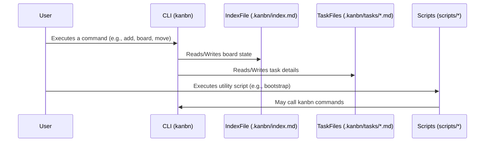

# ADR 002 - File Relationships and Interaction

- **Status**: Proposed
- **Date**: 2025-05-07

## Context

Understanding how files and scripts interact is crucial for maintaining and extending the Kanbn system. This ADR outlines the primary relationships between core data files, configuration, and executable scripts.

## Decision

The Kanbn system will revolve around a central `.kanbn` directory within the user's project. This directory will house the main `index.md` (the board), individual task files (in Markdown), and potentially other configuration or data files.

Key file interactions:

-   `kanbn` (CLI executable): Reads commands, interacts with `.kanbn/index.md` and task files.
-   `.kanbn/index.md`: Stores the board structure (columns, task references).
-   `.kanbn/tasks/<task-id>.md`: Stores details for individual tasks.
-   `docs/adrs/`: Contains Architectural Decision Records like this one.
-   `scripts/`: Contains utility and automation scripts.
-   `.gitignore`: Specifies intentionally untracked files.
-   `README.md`: Provides an overview of the project.

## Consequences

**Positive:**
-   Clear separation of concerns between data, configuration, and documentation.
-   Markdown-based data files are human-readable and easy to version control.
-   Centralized `.kanbn` directory keeps project-specific Kanbn data organized.

**Negative:**
-   Care must be taken to ensure consistency between `index.md` and individual task files, though `kanbn validate` will help.

## Mermaid Diagram: Key File Interactions

