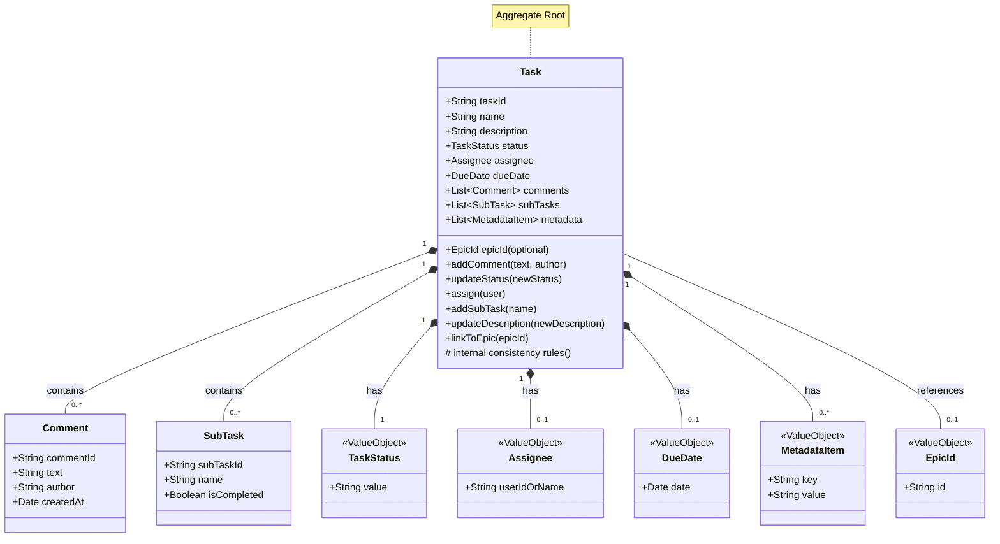

# ADR 007 - Aggregate Design for Task

- **Status**: Proposed
- **Date**: 2025-05-07

## Context

A `Task` in Kanbn is a central entity that can accumulate various pieces of related data (description, status, assignee, sub-tasks, comments, metadata, epic linkage). To maintain consistency and manage the lifecycle of a task and its associated objects cohesively, we are considering an Aggregate design pattern from Domain-Driven Design (DDD).

## Decision

We will model the `Task` as an Aggregate Root.

*   **Aggregate Root:** `Task`
*   **Entities within Aggregate:** `SubTask` (if treated as distinct entities managed only through the parent Task), `Comment`.
*   **Value Objects within Aggregate:** `TaskStatus`, `Assignee`, `DueDate`, `MetadataItem`.

**Responsibilities of the `Task` Aggregate Root:**

*   Ensuring its own invariants (e.g., a task ID must be unique, a task must have a name).
*   Managing the lifecycle of its internal entities (e.g., adding/removing a `Comment` or `SubTask`). Direct external modification of these internal entities would be disallowed; all changes go through the `Task` aggregate root.
*   Ensuring consistency across the aggregate (e.g., if a task is completed, its active sub-tasks might need a status update, or rules around adding comments to an archived task).

**Implementation Notes:**

*   In Kanbn's current file-based persistence, a single `<task-id>.md` file represents a serialized `Task` aggregate.
*   The `Task` object in the code (`task-utils.js` or similar) would act as the aggregate root when a task file is loaded into memory.
*   Operations like `kanbn comment <task-id> ...` would first load the `Task` aggregate, then call a method on it (e.g., `task.addComment(...)`), which would then handle updating its internal state and preparing for persistence.

## Consequences

**Positive:**
-   Improved consistency and integrity of task data, as all changes are managed through a single root.
-   Clearer transactional boundaries: operations on a task and its sub-entities are treated as a single unit.
-   Easier to reason about the state and behavior of a task.
-   The domain logic related to tasks is encapsulated within the aggregate.

**Negative:**
-   Could introduce more indirection or boilerplate if not carefully designed, especially for simple operations.
-   Requires careful consideration of what truly belongs inside the aggregate versus what might be a reference to another aggregate (e.g., an `Epic` is likely a separate aggregate that a `Task` references by ID).
-   Performance implications if aggregates become too large and are always loaded fully (though for Kanbn's scale with individual task files, this is less of a concern initially).

## Mermaid Class Diagram: Task Aggregate

