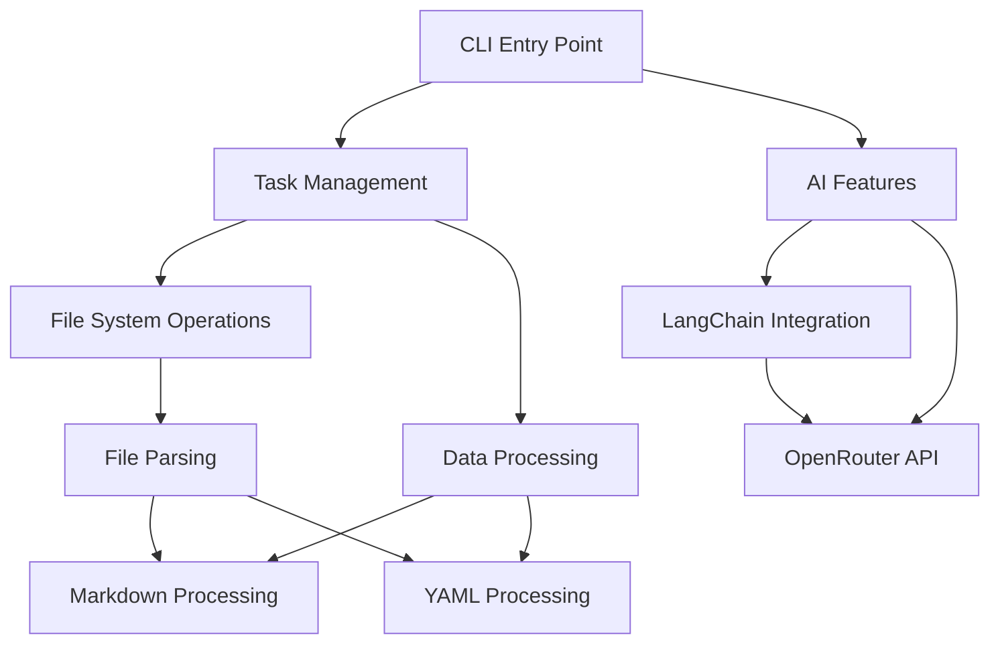

# Project Dependencies Documentation

## Runtime Dependencies

### AI/ML Components
- `@langchain/core` (v0.3.48): Core LangChain functionality for AI features
- `@langchain/ollama` (v0.2.0): Ollama integration for LangChain
- `langchain` (v0.3.24): Main LangChain library for AI capabilities

### UI and Terminal Interface
- `chalk` (v5.4.1): Terminal string styling
- `terminal-kit` (v1.44.0): Advanced terminal control and UI
- `inquirer` (v7.3.3): Interactive command line interface
  - `inquirer-autocomplete-prompt` (v1.3.0): Autocomplete functionality
  - `inquirer-datepicker` (v2.0.0): Date picking interface
  - `inquirer-recursive` (v0.0.7): Recursive prompts
  - `inquirer-select-line` (v1.3.3): Line selection interface

### Content Processing
- `markdown-it` (v14.1.0): Markdown parsing and rendering
  - `markdown-it-task-lists` (v2.1.1): Task list support
  - `markdown-it-terminal` (v0.4.0): Terminal-specific rendering
- `marked` (v1.2.7): Alternative markdown processor
  - `marked-terminal` (v4.1.1): Terminal-specific marked renderer
- `front-matter` (v4.0.2): YAML front matter parsing
- `yamljs` (v0.3.0): YAML parsing and stringifying
- `turndown` (v7.2.0): HTML to Markdown conversion
- `cheerio` (v1.0.0): HTML parsing and manipulation

### Date and Time Handling
- `chrono-node` (v2.1.10): Natural language date parsing
- `dateformat` (v4.3.1): Date formatting
- `humanize-duration` (v3.25.0): Human-readable time durations

### File System and Utilities
- `glob-promise` (v3.4.0): File pattern matching with promises
- `mkdirp` (v3.0.1): Recursive directory creation
- `rimraf` (v3.0.2): Recursive file deletion
- `minimist` (v1.2.5): Command line argument parsing
- `dotenv` (v8.6.0): Environment variable management

### HTTP and Network
- `axios` (v1.8.4): HTTP client
- `node-fetch` (v2.7.0): Fetch API implementation

### Miscellaneous Utilities
- `asciichart` (v1.5.25): ASCII line charts
- `fuzzy` (v0.1.3): Fuzzy string matching
- `git-user-name` (v2.0.0): Git username retrieval
- `handlebars` (v4.7.8): Template engine
- `jsonschema` (v1.4.0): JSON Schema validation
- `auto-load` (v3.0.4): Automatic module loading

## Development Dependencies

### Testing Framework
- `qunit` (v2.13.0): Unit testing framework
  - `qunit-reporter-junit` (v1.1.1): JUnit report generation
- `jest-html-reporter` (v4.1.0): HTML test reports
- `junit-viewer` (v4.11.1): JUnit report viewing

### Mocking and Test Utilities
- `mock-argv` (v1.1.10): Command line argument mocking
- `mock-fs` (v4.13.0): File system mocking
- `mock-require` (v3.0.3): Module require mocking
- `mock-stdin` (v1.0.0): Standard input mocking
- `mockdate` (v3.0.2): Date mocking
- `capture-console` (v1.0.1): Console output capture
- `faker` (v5.1.0): Test data generation

### Development Tools
- `typescript` (v4.9.3): TypeScript support
- `@types/typescript` (v2.0.0): TypeScript type definitions
- `fs-extra` (v11.3.0): Enhanced file system operations
- `rewire` (v7.0.0): Module dependency injection
- `strip-ansi` (v6.0.0): Remove ANSI escape codes

## External Service Dependencies

### OpenRouter Integration
- Used for AI features and language model access
- Requires API key configuration
- Configured through environment variables

### GitHub Integration
- Repository hosting and version control
- GitHub Actions for CI/CD
- GitHub Pages for documentation hosting

### Container Registry
- Quay.io for Docker image hosting
- Used in deployment workflows

## Version Constraints

- Node.js: >= 12.13.0
- Package overrides:
  - `glob`: ^7.2.3

## Security Considerations

1. API Keys and Secrets
   - OpenRouter API key must be secured
   - Environment variables used for sensitive data

2. Dependency Updates
   - Regular security audits recommended
   - Automated vulnerability scanning in place

3. Input Validation
   - JSON Schema validation for data
   - Markdown content sanitization

## Internal Module Dependencies

This diagram shows the high-level internal dependencies between major components of the system. 