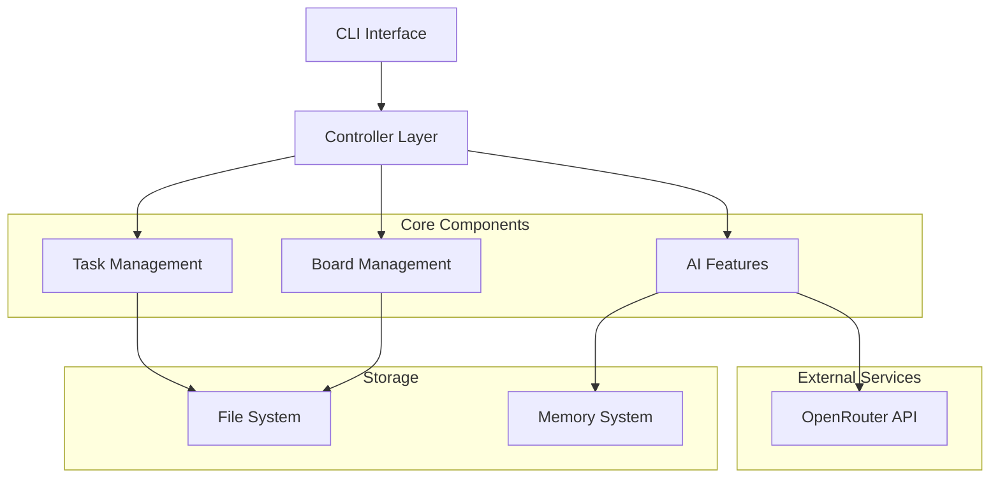
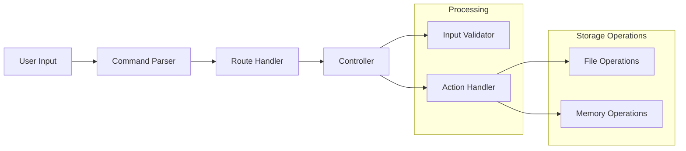
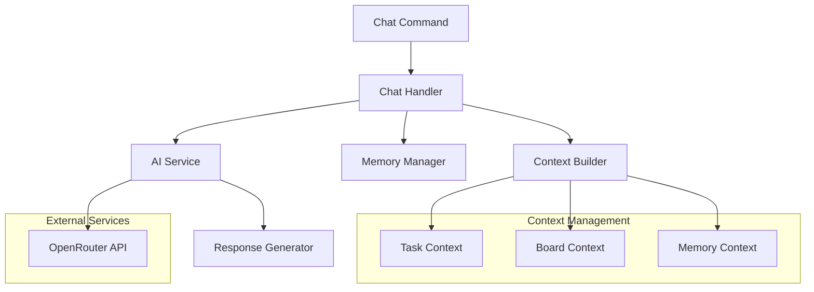
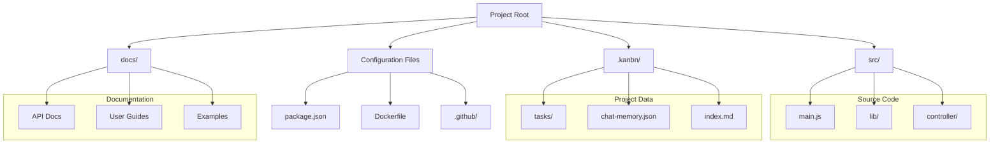

# Repository Analysis

## Overview
This document provides a comprehensive analysis of the Kanbn repository structure, architecture, and organization patterns.

## Architecture Diagrams

### High-Level System Architecture

### Command Processing Flow

### AI Feature Architecture

### Data and File Structure

## Directory Structure

### Core Application Code
- `src/` - Main source code directory
  - `main.js` - Primary application logic
  - `parse-task.js` - Task parsing functionality
  - `board.js` - Board management
  - `lib/` - Core library modules
  - `controller/` - Business logic controllers
  - `config/` - Configuration management
  - `data/` - Data models and structures

- `routes/` - API route definitions
  - Command-specific JSON configurations
  - Clear separation of routing and logic

- `bin/` - Executable files
- `index.js` - Application entry point

### Documentation
- `docs/` - Main documentation directory
  - User guides
  - API documentation
  - Architecture documentation
  - Examples and tutorials

### Configuration & Build
- `.github/` - CI/CD workflows
- `Dockerfile` & `docker-compose.yml` - Container configuration
- `package.json` - Project dependencies and scripts
- `Makefile` - Build and development tasks

### Testing
- `test/` - Test suite
- `examples/` - Usage examples
- `test-memory-system.js` - Memory subsystem tests

### Project Management
- `.kanbn/` - Kanban board data
- `tasks/` - Task management
- `.roo/` & `.cursor/` - Project rules and settings

## Architecture Patterns

### Modular Design
- Clear separation of concerns
- Route-based configuration
- Controller-based business logic
- Library modules for core functionality

### Main Components
1. Task Management
   - Task parsing and validation
   - State management
   - Persistence

2. Board Management
   - Column configuration
   - Task organization
   - Board state management

3. AI Features
   - Chat functionality
   - Task decomposition
   - Memory management

4. Configuration System
   - JSON-based configuration
   - Environment management
   - Build settings

## Development Infrastructure

### CI/CD
- GitHub Actions workflows
- Automated testing
- Docker build pipeline

### Development Tools
- TypeScript definitions
- ESLint configuration
- Editor settings

### Testing Framework
- Unit tests
- Integration tests
- Memory system tests

## Areas for Enhancement
1. Documentation
   - Architecture diagrams needed
   - Enhanced onboarding guide
   - RAG test documentation

2. Code Organization
   - Consider TypeScript migration
   - Enhanced error handling
   - Middleware standardization

3. Testing
   - Increase test coverage
   - Add performance tests
   - Document test patterns

## Dependencies
(To be documented after detailed review) 